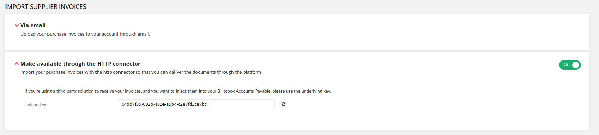
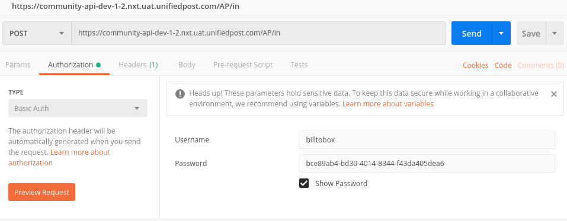
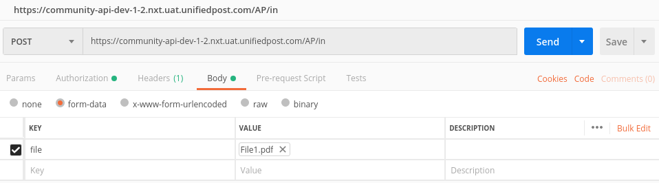
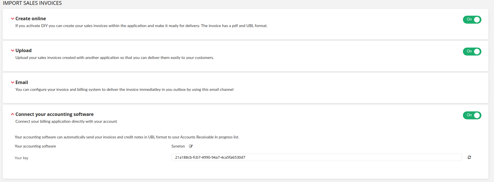
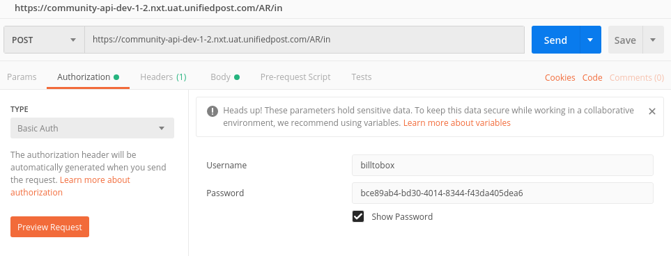
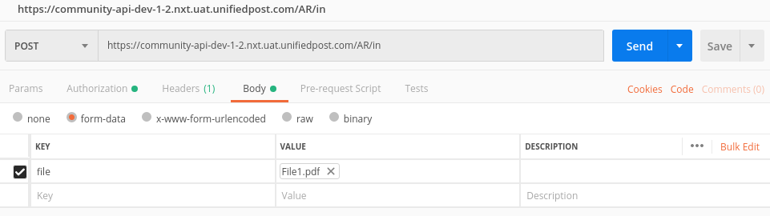

--- 

title: Community API 

toc_footers: 
   - <a href='#'>Sign Up for a Developer Key</a> 
   - <a href='https://github.com/lavkumarv'>Documentation Powered by lav</a> 

includes: 
   - errors 
   
language_tabs:
    - shell: cURL

search: true 

--- 

# Introduction 

This is the community API. 

**Version:** Community::VERSION

[Find out more about Swagger](http://swagger.io) 

# Authentication 

|apiKey|*Bearer*|
|---|---| 

|apiKey|*api_key*|
|---|---| 

|basic|*Basic authorization*|
|---|---| 

# Enterprise Community Settings
## /API/FRONTEND/V1/COMMUNITY_OWNER_SETTINGS
### ***POST*** 

**Summary:** This endpoint is used by community owner for updating and creating new community_settings

**Description:** 

#### HTTP Request 
`***POST*** /api/frontend/v1/community_owner_settings` 

**Parameters**

| Name | Located in | Description | Required | Type |
| ---- | ---------- | ----------- | -------- | ---- |
| Authorization | header | Authorization token | Yes | string |
| Identification | header | Value used to identify the community of the user | Yes | string |
| settings | body | Will contain keys and values that should be updated or created | Yes |  |

**Responses**

| Code | Description |
| ---- | ----------- |
| 200 | Data update was successful |
| 401 | Unauthorized. The authentication failed |
| 403 | Forbidden. You are not authorized to access this page. |
| 422 | Community settings data could not be updated successful |

# Corporate Connector
## /API/V1/DELIVER/INVOICE
### ***POST*** 

**Summary:** Uploads a document sent form Up delivery

**Description:** 

#### HTTP Request 
`***POST*** /api/v1/deliver/invoice` 

**Parameters**

| Name | Located in | Description | Required | Type |
| ---- | ---------- | ----------- | -------- | ---- |
| Authorization | header | value of auth header will be something like this: - Token token_value - where token_value will be provided for each environment in private | Yes | string |
| document | formData | File should have content-type application/xml, text/xml application/pdf or image. Attention only xml files will not require - document_data - the second file parameter describe below | Yes | file |
| document_data | formData | File should have content-type application/json. Attention this file is used to map metadata for received files. The format is xml-json. <a target="_blank" href="/swagger/docs/document_data.json">Example file</a>  | No | file |
| target | formData | ap_in is the only target value that is supported now | Yes | string |
| destination_uuid | formData | represents enterprise alert_key and is used to determine the enterprise | Yes | string |
| owner_name | formData | Represents the supplier name | No | string |
| owner_id | formData | represents the value of uniq company identifier for supplier and could be IBAN or UEN | No | string |
| owner_id_type | formData | represents type of identifier and could be IBAN or UEN and is used together with owner data to determine supplier | No | string |
| owner_email | formData | Represents the supplier email | No | string |
| cb_success | formData | url where success feedback will be posted | No | string |
| cb_error | formData | url where failure feedback will be posted | No | string |
| channel | formData |  | No | string |
| document_uuid | formData | document uniq identifier | Yes | string |
| source | formData | source name | Yes | string |

**Responses**

| Code | Description |
| ---- | ----------- |
| 200 | The Post of the document was correct |
| 400 | Bad request. Post could not be processed at the community |
| 401 | Unauthorized. The authentication failed |
| 422 | Returned if validations fail |

# Micro Frontends
## /API/FRONTEND/V1/ME/MICRO_FRONTENDS
### ***GET*** 

**Summary:** Retrieves available components for micro frontend rendering

**Description:** 

#### HTTP Request 
`***GET*** /api/frontend/v1/me/micro_frontends` 

**Parameters**

| Name | Located in | Description | Required | Type |
| ---- | ---------- | ----------- | -------- | ---- |
| mf_action | query | Identifier for action to be rendered as a micro frontend | Yes | string |

**Responses**

| Code | Description |
| ---- | ----------- |
| 200 | Succesful response |
| 422 | Returned if the mf_action parameter not passed |

## /API/FRONTEND/V1/ME/MICRO_FRONTENDS/TOKEN
### ***POST*** 

**Summary:** Creates a token for a VAS

**Description:** 

#### HTTP Request 
`***POST*** /api/frontend/v1/me/micro_frontends/token` 

**Parameters**

| Name | Located in | Description | Required | Type |
| ---- | ---------- | ----------- | -------- | ---- |
| body | body | vas identifier for which token is to be created | No |  |

**Responses**

| Code | Description |
| ---- | ----------- |
| 200 | succesful response |
| 412 | Returned if a precondition is missing, like vas config |
| 500 | Returned if requesting token from vas fails |

# Pay Incoming Documents
## /API/FRONTEND/V1/ME/ENTERPRISES/{ENTERPRISEID}/ARCHIVE/PAY_INCOMING_DOCUMENTS/BULK/{BULKACTION}
### ***POST*** 

**Summary:** Triggers payment on incoming documents

**Description:** 

#### HTTP Request 
`***POST*** /api/frontend/v1/me/enterprises/{enterpriseId}/archive/pay_incoming_documents/bulk/{bulkAction}` 

**Parameters**

| Name | Located in | Description | Required | Type |
| ---- | ---------- | ----------- | -------- | ---- |
| enterpriseId | path | Enterprise ID | Yes | integer |
| bulkAction | path | Bulk action name - for this context is should have value pay | Yes | string |
| selected_documents | query | up doc refs of selected documents | Yes | array |

**Responses**

| Code | Description |
| ---- | ----------- |
| 200 | Documents were sent to payment service |
| 400 | Bad request. Post could not be processed at the community |
| 401 | Unauthorized. The authentication failed |
| 422 | Returned if action is not supported, list of selected documents is empty or something went wrong returning the response |

## /API/FRONTEND/V1/ME/ENTERPRISES/{ENTERPRISEID}/ARCHIVE/PAY_INCOMING_DOCUMENTS/VALIDATE
### ***POST*** 

**Summary:** Validates payment data before payment is triggered on incoming documents

**Description:** 

#### HTTP Request 
`***POST*** /api/frontend/v1/me/enterprises/{enterpriseId}/archive/pay_incoming_documents/validate` 

**Parameters**

| Name | Located in | Description | Required | Type |
| ---- | ---------- | ----------- | -------- | ---- |
| enterpriseId | path | Enterprise ID | Yes | integer |
| selected_documents | query | up doc refs of selected documents that need to be validated | Yes | array |

**Responses**

| Code | Description |
| ---- | ----------- |
| 200 | When validation was finished ok and all documents are valid the response will be an empty hash. When validation was finished ok and some documents have validation issues then a response like below will be received: |
| 401 | Unauthorized. The authentication failed |
| 422 | Returned if payment service is not setup correctly and operation is not allowed |

## /API/VAS/V1/PAYMENTS/CAF_FAILURE_CALLBACK
### ***POST*** 

**Summary:** Triggers update on incoming documents with initial data, after a failure payment callback is received

**Description:** 

#### HTTP Request 
`***POST*** /api/vas/v1/payments/caf_failure_callback` 

**Parameters**

| Name | Located in | Description | Required | Type |
| ---- | ---------- | ----------- | -------- | ---- |
| body | body | parameters sent via callback containing data to be updated | No |  |

**Responses**

| Code | Description |
| ---- | ----------- |
| 200 | Data was received and update on documents was started. In this case the response will be {} |
| 401 | Unauthorized. The authentication failed |

## /API/FRONTEND/V1/ME/ENTERPRISES/{ENTERPRISEID}/ARCHIVE/PAY_INCOMING_DOCUMENTS/BANK_STATEMENTS
### ***GET*** 

**Summary:** Returns the list of statements between give start_date and end_date

**Description:** 

#### HTTP Request 
`***GET*** /api/frontend/v1/me/enterprises/{enterpriseId}/archive/pay_incoming_documents/bank_statements` 

**Parameters**

| Name | Located in | Description | Required | Type |
| ---- | ---------- | ----------- | -------- | ---- |
| enterpriseId | path | enterprise UUID | Yes | string |
| start_date | query | Start date of the statements. Format of the date should be YYYY-MM-DD | Yes | string |
| end_date | query | End date of the statements. Format of the date should be YYYY-MM-DD | Yes | string |

**Responses**

| Code | Description |
| ---- | ----------- |
| 200 | List of statements between given date |
| 401 | unauthorized |
| 422 | Error on retrieving list of statements. Could be due to parameters error or due to response error from OCS |

## /API/FRONTEND/V1/ME/ENTERPRISES/{ENTERPRISEID}/ARCHIVE/PAY_INCOMING_DOCUMENTS/BANK_STATEMENTS/{ID}
### ***GET*** 

**Summary:** Returns the bank statement by id

**Description:** 

#### HTTP Request 
`***GET*** /api/frontend/v1/me/enterprises/{enterpriseId}/archive/pay_incoming_documents/bank_statements/{id}` 

**Parameters**

| Name | Located in | Description | Required | Type |
| ---- | ---------- | ----------- | -------- | ---- |
| enterpriseId | path | enterprise UUID | Yes | string |
| id | path | id of the statement | Yes | string |
| format | query | format of the statement. Could have one of the following errors: CODA or CAMT-53 | Yes | string |

**Responses**

| Code | Description |
| ---- | ----------- |
| 200 | Bank statement given by id |
| 401 | unauthorized |
| 422 | Error on retrieving statement. Could be due to parameters error or due to response error from OCS |

## /API/FRONTEND/V1/ME/ENTERPRISES/{ENTERPRISEID}/ARCHIVE/PAY_INCOMING_DOCUMENTS/BANK_STATEMENTS/BULK_DELIVERY
### ***POST*** 

**Summary:** Sends selected bank statements zip to email address

**Description:** 

#### HTTP Request 
`***POST*** /api/frontend/v1/me/enterprises/{enterpriseId}/archive/pay_incoming_documents/bank_statements/bulk_delivery` 

**Parameters**

| Name | Located in | Description | Required | Type |
| ---- | ---------- | ----------- | -------- | ---- |
| enterpriseId | path | enterprise UUID | Yes | string |
| body | body |  | Yes |  |

**Responses**

| Code | Description |
| ---- | ----------- |
| 200 | Returns ok in case of success |
| 401 | unauthorized |
| 422 | Error on retrieving statement. Could be due to parameters error or due to response error from OCS |

## /API/FRONTEND/V1/ME/ENTERPRISES/{ENTERPRISEID}/ARCHIVE/PAY_INCOMING_DOCUMENTS/ACTIVITY_LOG
### ***GET*** 

**Summary:** Returns a list of payment related events

**Description:** 

#### HTTP Request 
`***GET*** /api/frontend/v1/me/enterprises/{enterpriseId}/archive/pay_incoming_documents/activity_log` 

**Parameters**

| Name | Located in | Description | Required | Type |
| ---- | ---------- | ----------- | -------- | ---- |
| enterpriseId | path | The enterprise id. | Yes | string |
| from | query | The start date used to filter the list of events. | Yes | string |
| to | query | The end date used to filter the list of events. | Yes | string |
| user_email | query | Used to filter the list of events by user. If not provided all events are returned. | No | string |

**Responses**

| Code | Description |
| ---- | ----------- |
| 200 | Returns the list in case of success. |
| 401 | unauthorized |
| 422 | Error on retrieving the event list. Could be due to parameters error or due to feature toggle |

## /API/FRONTEND/V1/ME/ENTERPRISES/{ENTERPRISEID}/VALUE_ADDED_SERVICES/ONLINE_COLLECT_SERVICES/PAYMENT_ACCOUNTS
### ***GET*** 

**Summary:** Returns a list of payment accounts that have been registered in PXG for the current enterprise

**Description:** 

#### HTTP Request 
`***GET*** /api/frontend/v1/me/enterprises/{enterpriseId}/value_added_services/online_collect_services/payment_accounts` 

**Parameters**

| Name | Located in | Description | Required | Type |
| ---- | ---------- | ----------- | -------- | ---- |
| enterpriseId | path | The enterprise id. | Yes | string |

**Responses**

| Code | Description |
| ---- | ----------- |
| 200 | Returns the list of account ibans and balances. |
| 401 | unauthorized |
| 422 | Error on retrieving the event list. In case something fails when accessing PXG. |

## /API/FRONTEND/V1/ME/ENTERPRISES/{ENTERPRISEID}/VALUE_ADDED_SERVICES/ONLINE_COLLECT_SERVICES/PAYMENT_ACCOUNTS_TRANSACTIONS
### ***GET*** 

**Summary:** Returns a list of transactions for the given iban

**Description:** 

#### HTTP Request 
`***GET*** /api/frontend/v1/me/enterprises/{enterpriseId}/value_added_services/online_collect_services/payment_accounts_transactions` 

**Parameters**

| Name | Located in | Description | Required | Type |
| ---- | ---------- | ----------- | -------- | ---- |
| enterpriseId | path | The enterprise id. | Yes | string |
| q[iban] | query | The payment account iban. | Yes | string |
| q[start_date] | query | The start date of the transaction range. | Yes | string |
| q[end_date] | query | The end date of the transaction range. | Yes | string |
| page | query | The page number of the transaction list. | Yes | string |

**Responses**

| Code | Description |
| ---- | ----------- |
| 200 | Returns the list of account ibans and balances. |
| 401 | unauthorized |
| 422 | Error on retrieving the event list. In case something fails when accessing PXG or missing required param. |

## /API/FRONTEND/V1/ME/ENTERPRISES/{ENTERPRISEID}/ARCHIVE/PAY_INCOMING_DOCUMENTS/ACTIVITY_LOG/{ID}
### ***GET*** 

**Summary:** Returns the event details associated with a payment event

**Description:** 

#### HTTP Request 
`***GET*** /api/frontend/v1/me/enterprises/{enterpriseId}/archive/pay_incoming_documents/activity_log/{id}` 

**Parameters**

| Name | Located in | Description | Required | Type |
| ---- | ---------- | ----------- | -------- | ---- |
| enterpriseId | path | The enterprise id. | Yes | string |
| id | path | The requested event id. | Yes | string |

**Responses**

| Code | Description |
| ---- | ----------- |
| 200 | Returns the event details in case of success. |
| 401 | unauthorized |
| 422 | Error on retrieving the event details. Due to feature toggle off. |

# Archive Connector
## /API/ARCHIVE_CONNECTOR/V1/ARCHIVE/AP
### ***POST*** 

**Summary:** Uploads a document directly in archive if all necessary fields exist

**Description:** 

#### HTTP Request 
`***POST*** /api/archive_connector/v1/archive/ap` 

**Parameters**

| Name | Located in | Description | Required | Type |
| ---- | ---------- | ----------- | -------- | ---- |
| file | formData | File should have content-type application/xml, text/xml application/pdf or image. Attention only completed xml files will be archived directly, for the rest the user has to fill the missing data first | Yes | file |
| lang | formData |  | No | string |

**Responses**

| Code | Description |
| ---- | ----------- |
| 200 | The Post of the document was correct |
| 400 | Bad request. Post could not be processed at the community |
| 401 | Unauthorized. The authentication failed |
| 404 | Not found. Called end point is not correct |
| 422 | Returned if validations fail |

## /API/ARCHIVE_CONNECTOR/V1/ARCHIVE/AR
### ***POST*** 

**Summary:** Uploads a document directly in archive if all necessary fields exist

**Description:** 

#### HTTP Request 
`***POST*** /api/archive_connector/v1/archive/ar` 

**Parameters**

| Name | Located in | Description | Required | Type |
| ---- | ---------- | ----------- | -------- | ---- |
| file | formData | File should have content-type application/xml or text/xml | Yes | file |
| lang | formData | Language for showing the errors | No | string |

**Responses**

| Code | Description |
| ---- | ----------- |
| 200 | The Post of the document was correct |
| 400 | Bad request. Post could not be processed at the community |
| 401 | Unauthorized. The authentication failed |
| 404 | Not found. Called end point is not correct |
| 422 | Returned if validations fail |

# Administrative Connector - enterprises
## /API/ADMINISTRATIVE_CONNECTOR/ENTERPRISES
### ***POST*** 

**Summary:** Creates an Enterprise

**Description:** 

#### HTTP Request 
`***POST*** /api/administrative_connector/enterprises` 

**Parameters**

| Name | Located in | Description | Required | Type |
| ---- | ---------- | ----------- | -------- | ---- |
| Identification | header | Community Identifier | Yes | string |
| Content-Type | header | Content Type | Yes | string |
| body | body |  | Yes |  |

**Responses**

| Code | Description |
| ---- | ----------- |
| 200 | Success |
| 401 | unauthorized |
| 422 | returned if validations fail |

### ***PUT*** 

**Summary:** Updates an enterprise

**Description:** 

#### HTTP Request 
`***PUT*** /api/administrative_connector/enterprises` 

**Parameters**

| Name | Located in | Description | Required | Type |
| ---- | ---------- | ----------- | -------- | ---- |
| Identification | header | Community Identifier | Yes | string |
| Content-Type | header | Content Type | Yes | string |
| body | body |  | Yes |  |

**Responses**

| Code | Description |
| ---- | ----------- |
| 200 | Success |
| 401 | unauthorized |
| 404 | Enterprise does not exists |
| 422 | returned if validations fail |

## /API/ADMINISTRATIVE_CONNECTOR/ENTERPRISES/STATUS
### ***GET*** 

**Summary:** Get status of an enterprise

**Description:** 

#### HTTP Request 
`***GET*** /api/administrative_connector/enterprises/status` 

**Parameters**

| Name | Located in | Description | Required | Type |
| ---- | ---------- | ----------- | -------- | ---- |
| Identification | header | Community Identifier | Yes | string |
| Content-Type | header | Content Type | Yes | string |
| enterprise_uuid | query | Enterprise UUID | Yes | string |

**Responses**

| Code | Description |
| ---- | ----------- |
| 200 | Success |
| 401 | Unauthorized |
| 422 | When Enterprise is not found |

# Administrative Connector - users
## /API/ADMINISTRATIVE_CONNECTOR/USERS
### ***POST*** 

**Summary:** Creates an user

**Description:** 

#### HTTP Request 
`***POST*** /api/administrative_connector/users` 

**Parameters**

| Name | Located in | Description | Required | Type |
| ---- | ---------- | ----------- | -------- | ---- |
| Identification | header | Community Identifier | Yes | string |
| Content-Type | header | Content Type | Yes | string |
| body | body |  | Yes |  |

**Responses**

| Code | Description |
| ---- | ----------- |
| 200 | Success |
| 401 | unauthorized |
| 422 | returned if validations fail |

### ***PUT*** 

**Summary:** Updates an user

**Description:** 

#### HTTP Request 
`***PUT*** /api/administrative_connector/users` 

**Parameters**

| Name | Located in | Description | Required | Type |
| ---- | ---------- | ----------- | -------- | ---- |
| Identification | header | Community Identifier | Yes | string |
| Content-Type | header | Content Type | Yes | string |
| body | body |  | Yes |  |

**Responses**

| Code | Description |
| ---- | ----------- |
| 200 | Success |
| 401 | unauthorized |
| 404 | User does not exists |
| 422 | returned if validations fail |

## /API/ADMINISTRATIVE_CONNECTOR/USERS/REINVITE
### ***POST*** 

**Summary:** Reinvites an user

**Description:** 

#### HTTP Request 
`***POST*** /api/administrative_connector/users/reinvite` 

**Parameters**

| Name | Located in | Description | Required | Type |
| ---- | ---------- | ----------- | -------- | ---- |
| Identification | header | Community Identifier | Yes | string |
| Content-Type | header | Content Type | Yes | string |
| body | body |  | Yes |  |

**Responses**

| Code | Description |
| ---- | ----------- |
| 200 | Success |
| 401 | unauthorized |
| 404 | User does not exists |
| 422 | returned if validations fail |

## /API/ADMINISTRATIVE_CONNECTOR/USERS/REMOVE_ENTERPRISE
### ***POST*** 

**Summary:** Removes an enterprise from an user

**Description:** 

#### HTTP Request 
`***POST*** /api/administrative_connector/users/remove_enterprise` 

**Parameters**

| Name | Located in | Description | Required | Type |
| ---- | ---------- | ----------- | -------- | ---- |
| Identification | header | Community Identifier | Yes | string |
| Content-Type | header | Content Type | Yes | string |
| body | body |  | Yes |  |

**Responses**

| Code | Description |
| ---- | ----------- |
| 200 | Success |
| 401 | unauthorized |
| 404 | User does not exists |
| 422 | returned if validations fail |

## /API/ADMINISTRATIVE_CONNECTOR/USERS/STATUS
### ***GET*** 

**Summary:** Get status of an enterprise user

**Description:** 

#### HTTP Request 
`***GET*** /api/administrative_connector/users/status` 

**Parameters**

| Name | Located in | Description | Required | Type |
| ---- | ---------- | ----------- | -------- | ---- |
| Identification | header | Community Identifier | Yes | string |
| Content-Type | header | Content Type | Yes | string |
| enterprise_uuid | query | Enterprise UUID | Yes | string |
| email | query | Enterprise user email | Yes | string |

**Responses**

| Code | Description |
| ---- | ----------- |
| 200 | Success |
| 401 | Unauthorized |
| 422 | When Enterprise or User are not found |

# Tasks Coala
## /API/ADMINISTRATIVE_CONNECTOR/ENTERPRISES/{ENTERPRISEID}/TASKS/{ID}
### ***PUT*** 

**Summary:** Update a task

**Description:** 

#### HTTP Request 
`***PUT*** /api/administrative_connector/enterprises/{enterpriseId}/tasks/{id}` 

**Parameters**

| Name | Located in | Description | Required | Type |
| ---- | ---------- | ----------- | -------- | ---- |
| enterpriseId | path | enterprise UUID | Yes | integer |
| id | path | task ID | Yes | integer |
| Identification | header | Community Identifier | Yes | string |
| Content-Type | header | Content Type | Yes | string |
| Accept | header | Accept | Yes | string |
| body | body |  | Yes |  |

**Responses**

| Code | Description |
| ---- | ----------- |
| 200 | Success |
| 401 | unauthorized |
| 404 | Task/Enterprise not found |
| 422 | returned if some validations fail |
| 503 | Task service server error |

# Integrated OCR
## /API/FRONTEND/V1/ME/ENTERPRISES/{ENTERPRISEID}/INTEGRATED_OCR_ENABLED
### ***GET*** 

**Summary:** Provides a boolean that represents the availability of integrated ocr 

**Description:** integrated ocr enabled

#### HTTP Request 
`***GET*** /api/frontend/v1/me/enterprises/{enterpriseId}/integrated_ocr_enabled` 

**Parameters**

| Name | Located in | Description | Required | Type |
| ---- | ---------- | ----------- | -------- | ---- |
| enterpriseId | path | Enterprise ID | Yes | integer |

**Responses**

| Code | Description |
| ---- | ----------- |
| 200 | Returns a json: { enabled: true/false } |
| 403 | When user does not have proper role |

# Accounts Payable v1
## /API/FRONTEND/V1/ME/ENTERPRISES/{ENTERPRISEID}/INCOMING_DOCUMENTS/FILE_UPLOAD
### ***POST*** 

**Summary:** Uploads a file on Accounts Payable

**Description:** authorize

#### HTTP Request 
`***POST*** /api/frontend/v1/me/enterprises/{enterpriseId}/incoming_documents/file_upload` 

**Parameters**

| Name | Located in | Description | Required | Type |
| ---- | ---------- | ----------- | -------- | ---- |
| Identification | header | Community Identifier | Yes | string |
| enterpriseId | path | Enterprise ID | Yes | integer |
| document_type | formData | Document type | No | string |
| payment_status | formData | Payment status | No | string |

**Responses**

| Code | Description |
| ---- | ----------- |
| 200 | The Post of the document was correct |
| 400 | Bad request. Post could not be processed at the community |
| 401 | Unauthorized. The authentication failed |
| 403 | When user does not have proper role |
| 404 | Not found. Called end point is not correct |
| 422 | Unprocessable Entity. Returned if uploaded file type is not correct. |


## /API/FRONTEND/V1/ME/ENTERPRISES/{ENTERPRISEID}/SEPA/DOWNLOAD/{FILENAME}/*PATH
### ***GET*** 

**Summary:** Allows download of SEPA SCT File

**Description:** authorize

#### HTTP Request 
`***GET*** /api/frontend/v1/me/enterprises/{enterpriseId}/sepa/download/{filename}/*path` 

**Parameters**

| Name | Located in | Description | Required | Type |
| ---- | ---------- | ----------- | -------- | ---- |
| Identification | header | Community Identifier | Yes | string |
| enterpriseId | path | Enterprise ID | Yes | integer |
| filename | path | Filename | Yes | string |
| path | path | UPFile path | Yes | string |

**Responses**

| Code | Description |
| ---- | ----------- |
| 200 | Returns an xml |
| 403 | When user does not have proper role |
| 404 | When enterprise cannot be found |

## /API/FRONTEND/V1/ME/ENTERPRISES/{ENTERPRISEID}/INCOMING_DRAFT_DOCUMENTS/{ID}
### ***GET*** 

**Summary:** Returns document details (contains draft document data)

**Description:** authorize

#### HTTP Request 
`***GET*** /api/frontend/v1/me/enterprises/{enterpriseId}/incoming_draft_documents/{id}` 

**Parameters**

| Name | Located in | Description | Required | Type |
| ---- | ---------- | ----------- | -------- | ---- |
| enterpriseId | path | Enterprise ID | Yes | integer |
| id | path | Document id: up_doc_ref of draft document | Yes | string |

**Responses**

| Code | Description |
| ---- | ----------- |
| 200 | Document details |
| 401 | unauthorized |
| 403 | When user does not have proper role |
| 404 | When document cannot be found |

### ***PUT*** 

**Summary:** Updates draft document and cmis document

**Description:** authorize

#### HTTP Request 
`***PUT*** /api/frontend/v1/me/enterprises/{enterpriseId}/incoming_draft_documents/{id}` 

**Parameters**

| Name | Located in | Description | Required | Type |
| ---- | ---------- | ----------- | -------- | ---- |
| enterpriseId | path | Enterprise ID | Yes | integer |
| id | path | Document id: up_doc_ref of draft document | Yes | string |
| body | body | Data about document | Yes |  |

**Responses**

| Code | Description |
| ---- | ----------- |
| 200 | In case document is not duplicated response will be {}  |
| 401 | unauthorized |
| 403 | When user does not have proper role |

### ***DELETE*** 

**Summary:** Removes draft document and cmis document (if it is the case)

**Description:** authorize

#### HTTP Request 
`***DELETE*** /api/frontend/v1/me/enterprises/{enterpriseId}/incoming_draft_documents/{id}` 

**Parameters**

| Name | Located in | Description | Required | Type |
| ---- | ---------- | ----------- | -------- | ---- |
| enterpriseId | path | Enterprise ID | Yes | integer |
| id | path | Document id: up_doc_ref of draft document | Yes | string |

**Responses**

| Code | Description |
| ---- | ----------- |
| 200 | No Content |
| 401 | unauthorized |
| 403 | When user does not have proper role |

## /API/FRONTEND/V1/ME/ENTERPRISES/{ENTERPRISEID}/INCOMING_DRAFT_DOCUMENTS/{ID}/ARCHIVE
### ***PUT*** 

**Summary:** Sends a document with status to_be_archived into archive

**Description:** authorize

#### HTTP Request 
`***PUT*** /api/frontend/v1/me/enterprises/{enterpriseId}/incoming_draft_documents/{id}/archive` 

**Parameters**

| Name | Located in | Description | Required | Type |
| ---- | ---------- | ----------- | -------- | ---- |
| enterpriseId | path | Enterprise ID | Yes | integer |
| id | path | Document id: up_doc_ref of draft document | Yes | string |
| body | body | Data about document | Yes |  |

**Responses**

| Code | Description |
| ---- | ----------- |
| 200 | In case document is not duplicated response will be {}  |
| 401 | unauthorized |
| 403 | When user does not have proper role |

## /API/FRONTEND/V1/ME/ENTERPRISES/{ENTERPRISEID}/INCOMING_DRAFT_DOCUMENTS/{ID}/SUPPLIER
### ***GET*** 

**Summary:** Returns supplier data that comes from mining the XML

**Description:** authorize

#### HTTP Request 
`***GET*** /api/frontend/v1/me/enterprises/{enterpriseId}/incoming_draft_documents/{id}/supplier` 

**Parameters**

| Name | Located in | Description | Required | Type |
| ---- | ---------- | ----------- | -------- | ---- |
| enterpriseId | path | Enterprise ID | Yes | integer |
| id | path | Document id: up_doc_ref of draft document | Yes | string |

**Responses**

| Code | Description |
| ---- | ----------- |
| 200 | In case data does not exist for the document, the response will contain a hash in the following format {"supplier_fields": {}}  |
| 403 | When user does not have proper role |
| 404 | When draft document cannot be found |

## /API/FRONTEND/V1/ME/ENTERPRISES/{ENTERPRISEID}/INCOMING_DOCUMENTS/{ID}
### ***GET*** 

**Summary:** Returns the document data from the long term storage for an archived document

**Description:** authorize

#### HTTP Request 
`***GET*** /api/frontend/v1/me/enterprises/{enterpriseId}/incoming_documents/{id}` 

**Parameters**

| Name | Located in | Description | Required | Type |
| ---- | ---------- | ----------- | -------- | ---- |
| enterpriseId | path | Enterprise ID | Yes | integer |
| id | path | Document id: up_doc_ref of draft document | Yes | string |

**Responses**

| Code | Description |
| ---- | ----------- |
| 200 | CMIS Document Details |
| 403 | When user does not have proper role |
| 404 | When cmis document cannot be found |

# Accounts Payable v2
## /API/V2/COM/ENTERPRISES/{ENTERPRISEID}/DOCUMENTS
### ***GET*** 

**Summary:** Returns a list of documents

**Description:** authorize

#### HTTP Request 
`***GET*** /api/v2/com/enterprises/{enterpriseId}/documents` 

**Parameters**

| Name | Located in | Description | Required | Type |
| ---- | ---------- | ----------- | -------- | ---- |
| Identification | header | Community Identifier | Yes | string |
| enterpriseId | path | Enterprise ID | Yes | integer |
| selected_documents | query | A list of up_doc_refs used to filter the result. | No | array |
| page | query | The page number of the paginated result list. | No | integer |
| items_per_page | query | The number of items to be displayed per page. | No | integer |
| sort | query | The column name used to sort the results. | No | string |
| direction | query | The sort direction. | No | string |
| q[supplier_id] | query | The supplier id. | No | integer |
| q[supplier_company_name] | query | The supplier name. | No | string |
| q[invoice_date_gteq] | query | The invoice date from. Format YYYY-MM-DD. | No | string |
| q[invoice_date_lteq] | query | The invoice date to. Format YYYY-MM-DD. | No | string |
| q[created_at_gteq] | query | The creation date from. Format YYYY-MM-DD. | No | string |
| q[created_at_lteq] | query | The creation date to. Format YYYY-MM-DD. | No | string |
| q[source] | query | The source from where the document originated. | No | string |
| q[filename] | query | The original filename of the document. | No | string |
| q[payment_due_date_gteq] | query | The payment due date from. Format YYYY-MM-DD. | No | string |
| q[payment_due_date_lteq] | query | The payment due date to. Format YYYY-MM-DD. | No | string |
| q[invoice_number] | query | The invoice number. | No | string |
| q[invoice_type] | query | The invoice type. | No | integer |
| q[invoice_amount_gteq] | query | The invoice amount from. | No | integer |
| q[invoice_amount_lteq] | query | The invoice amount to. | No | integer |
| q[invoice_currency] | query | The invoice currency. | No | string |
| q[display_status] | query | The display status of the document. | No | string |
| q[accounting_status] | query | The status of the document if it was sent to accounting. | No | string |
| include_paid | query | If true will return the documents with the payment status paid | No | string |
| include_supplier_ibans | query | If true will append the list of supplier ibans in the supplier section. | No | string |

**Responses**

| Code | Description |
| ---- | ----------- |
| 200 | Returns list of documents |
| 403 | When user does not have proper role |
| 404 | When enterprise cannot be found |

## /API/V2/COM/ENTERPRISES/{ENTERPRISEID}/TASKS/{ID}/SUPPLIER
### ***GET*** 

**Summary:** Returns supplier data that comes from mining the XML

**Description:** authorize

#### HTTP Request 
`***GET*** /api/v2/com/enterprises/{enterpriseId}/tasks/{id}/supplier` 

**Parameters**

| Name | Located in | Description | Required | Type |
| ---- | ---------- | ----------- | -------- | ---- |
| Identification | header | Community Identifier | Yes | string |
| enterpriseId | path | Enterprise ID | Yes | integer |
| id | path | Task ID | Yes | string |

**Responses**

| Code | Description |
| ---- | ----------- |
| 200 | In case data does not exist for the task, the response will contain a hash in the following format {"supplier_fields": {}}  |
| 403 | When user does not have proper role |
| 404 | When task cannot be found |

## /API/V2/COM/ENTERPRISES/{ENTERPRISEID}/TASKS/COMPACT
### ***GET*** 

**Summary:** Return a paginated, compacted list of tasks with the task ids and types

**Description:** authorize

#### HTTP Request 
`***GET*** /api/v2/com/enterprises/{enterpriseId}/tasks/compact` 

**Parameters**

| Name | Located in | Description | Required | Type |
| ---- | ---------- | ----------- | -------- | ---- |
| Identification | header | Community Identifier | Yes | string |
| enterpriseId | path | Enterprise ID | Yes | integer |
| page | query | page number | No | integer |

**Responses**

| Code | Description |
| ---- | ----------- |
| 200 | In case the task data does not exist, the response will contain a hash in the following format {"items": {}, items_per_page: 10, total_count: 0}  |
| 403 | When user does not have proper role |

## /API/V2/COM/ENTERPRISES/{ENTERPRISEID}/DOCUMENTS/{ID}
### ***GET*** 

**Summary:** Returns document details(contains task data)

**Description:** authorize

#### HTTP Request 
`***GET*** /api/v2/com/enterprises/{enterpriseId}/documents/{id}` 

**Parameters**

| Name | Located in | Description | Required | Type |
| ---- | ---------- | ----------- | -------- | ---- |
| Identification | header | Community Identifier | Yes | string |
| enterpriseId | path | Enterprise ID | Yes | integer |
| id | path | Task ID | Yes | string |

**Responses**

| Code | Description |
| ---- | ----------- |
| 200 | Document Details  |
| 403 | When user does not have proper role |
| 404 | When draft or task cannot be found |

## /API/V2/COM/ENTERPRISES/{ENTERPRISEID}/MULTIPLE_FILES_INTAKE
### ***GET*** 

**Summary:** Loads multiple files intakes list

**Description:** 

#### HTTP Request 
`***GET*** /api/v2/com/enterprises/{enterpriseId}/multiple_files_intake` 

**Parameters**

| Name | Located in | Description | Required | Type |
| ---- | ---------- | ----------- | -------- | ---- |
| Identification | header | Community Identifier | Yes | string |
| enterpriseId | path | Enterprise ID | Yes | integer |
| sort | query | sort field name. | No | string |
| direction | query | direction of the sort(asc or desc). | No | string |
| page | query | page number | No | integer |

**Responses**

| Code | Description |
| ---- | ----------- |
| 200 | OK |

## /API/V2/COM/ENTERPRISES/{ENTERPRISEID}/MULTIPLE_FILES_INTAKE/{ID}
### ***GET*** 

**Summary:** Show details of specific filter task

**Description:** 

#### HTTP Request 
`***GET*** /api/v2/com/enterprises/{enterpriseId}/multiple_files_intake/{id}` 

**Parameters**

| Name | Located in | Description | Required | Type |
| ---- | ---------- | ----------- | -------- | ---- |
| Identification | header | Community Identifier | Yes | string |
| enterpriseId | path | Enterprise ID | Yes | integer |
| id | path | Task ID | Yes | string |

**Responses**

| Code | Description |
| ---- | ----------- |
| 200 | OK |
| 404 | When filter task cannot be found |

# Subscription Notifications
## /API/FRONTEND/V1/SUBSCRIPTION_NOTIFICATIONS
### ***POST*** 

**Summary:** Submit a subscription notification to a tenant callback url

**Description:** 

#### HTTP Request 
`***POST*** /api/frontend/v1/subscription_notifications` 

**Parameters**

| Name | Located in | Description | Required | Type |
| ---- | ---------- | ----------- | -------- | ---- |
| Authorization | header | Community setting value where the key is the one for purchase engine and the value is the tenant token from purchase engine (eg. Token token=1234) | Yes | string |
| params (type and payload) | body |  | Yes |  |

**Responses**

| Code | Description |
| ---- | ----------- |
| 200 | OK |
| 401 | Unauthorized http token request |
| 412 | If subscription_enabled setting is not set to true |

# Subscriptions
## /API/FRONTEND/V1/ME/ENTERPRISES/{ENTERPRISEID}/SUBSCRIPTIONS/ACTIVE
### ***GET*** 

**Summary:** View active subscriptions on an enterprise

**Description:** 

#### HTTP Request 
`***GET*** /api/frontend/v1/me/enterprises/{enterpriseId}/subscriptions/active` 

**Parameters**

| Name | Located in | Description | Required | Type |
| ---- | ---------- | ----------- | -------- | ---- |
| Identification | header | Community Identifier | Yes | string |
| enterpriseId | path | Enterprise ID | Yes | integer |

**Responses**

| Code | Description |
| ---- | ----------- |
| 200 | OK |
| 412 | If subscription_enabled setting is not set to true |
| 502 | Billing Engine is down |

## /API/FRONTEND/V1/ME/ENTERPRISES/{ENTERPRISEID}/SUBSCRIPTIONS/ACTIVE/FEATURES/{FEATURETYPE}
### ***GET*** 

**Summary:** Check active features on enterprise subscriptions

**Description:** 

#### HTTP Request 
`***GET*** /api/frontend/v1/me/enterprises/{enterpriseId}/subscriptions/active/features/{featureType}` 

**Parameters**

| Name | Located in | Description | Required | Type |
| ---- | ---------- | ----------- | -------- | ---- |
| Identification | header | Community Identifier | Yes | string |
| enterpriseId | path | Enterprise ID | Yes | integer |
| featureType | path | Feature type | Yes | string |

**Responses**

| Code | Description |
| ---- | ----------- |
| 200 | OK |
| 412 | If subscription_enabled setting is not set to true |
| 502 | Billing Engine is down |

## /API/FRONTEND/V1/ME/ENTERPRISES/{ENTERPRISEID}/SUBSCRIPTIONS/ACTIVE/ALL_FEATURES
### ***GET*** 

**Summary:** Check requested features on enterprise subscriptions

**Description:** 

#### HTTP Request 
`***GET*** /api/frontend/v1/me/enterprises/{enterpriseId}/subscriptions/active/all_features` 

**Parameters**

| Name | Located in | Description | Required | Type |
| ---- | ---------- | ----------- | -------- | ---- |
| Identification | header | Community Identifier | Yes | string |
| enterpriseId | path | Enterprise ID | Yes | integer |
| features | query | Checked features | Yes | string |

**Responses**

| Code | Description |
| ---- | ----------- |
| 200 | OK |
| 412 | If subscription_enabled setting is not set to true |
| 502 | Billing Engine is down |

## /API/FRONTEND/V1/ME/ENTERPRISES/{ENTERPRISEID}/SUBSCRIPTIONS/ACTIVE/BUNDLE_USAGE
### ***GET*** 

**Summary:** Get the accumulated count of used/remaining/total items for all bundles

**Description:** 

#### HTTP Request 
`***GET*** /api/frontend/v1/me/enterprises/{enterpriseId}/subscriptions/active/bundle_usage` 

**Parameters**

| Name | Located in | Description | Required | Type |
| ---- | ---------- | ----------- | -------- | ---- |
| Identification | header | Community Identifier | Yes | string |
| enterpriseId | path | Enterprise ID | Yes | integer |
| name | query | Filter usages by a specific bundle category name. A few examples are archived_documents, mandates, print_and_post, etc | No | string |

**Responses**

| Code | Description |
| ---- | ----------- |
| 200 | OK |
| 412 | If subscription_enabled setting is not set to true |
| 422 | If filter is invalid |
| 502 | Billing Engine is down |

## /API/FRONTEND/V1/ME/ENTERPRISES/{ENTERPRISEID}/SUBSCRIPTIONS/INDEX_BY_GROUP
### ***GET*** 

**Summary:** View grouped subscriptions on an enterprise

**Description:** 

#### HTTP Request 
`***GET*** /api/frontend/v1/me/enterprises/{enterpriseId}/subscriptions/index_by_group` 

**Parameters**

| Name | Located in | Description | Required | Type |
| ---- | ---------- | ----------- | -------- | ---- |
| Identification | header | Community Identifier | Yes | string |
| enterpriseId | path | Enterprise ID | Yes | integer |

**Responses**

| Code | Description |
| ---- | ----------- |
| 200 | OK |
| 412 | If subscription_enabled setting is not set to true |
| 502 | Billing Engine is down |

## /API/FRONTEND/V1/ME/ENTERPRISES/{ENTERPRISEID}/SUBSCRIPTIONS
### ***POST*** 

**Summary:** Activate a subscription for an enterprise

**Description:** 

#### HTTP Request 
`***POST*** /api/frontend/v1/me/enterprises/{enterpriseId}/subscriptions` 

**Parameters**

| Name | Located in | Description | Required | Type |
| ---- | ---------- | ----------- | -------- | ---- |
| Identification | header | Community Identifier | Yes | string |
| enterpriseId | path |  | Yes | integer |
| body | body |  | Yes |  |

**Responses**

| Code | Description |
| ---- | ----------- |
| 201 | OK |
| 412 | If subscription_enabled setting is not set to true |
| 422 | When subscription could not be created |
| 502 | Billing Engine is down |

## /API/FRONTEND/V1/ME/ENTERPRISES/{ENTERPRISEID}/SUBSCRIPTIONS/CANCEL
### ***PUT*** 

**Summary:** Cancel subscription on an enterprise

**Description:** 

#### HTTP Request 
`***PUT*** /api/frontend/v1/me/enterprises/{enterpriseId}/subscriptions/cancel` 

**Parameters**

| Name | Located in | Description | Required | Type |
| ---- | ---------- | ----------- | -------- | ---- |
| Identification | header | Community Identifier | Yes | string |
| enterpriseId | path | Enterprise ID | Yes | integer |

**Responses**

| Code | Description |
| ---- | ----------- |
| 204 | OK |
| 412 | If subscription_enabled setting is not set to true |
| 502 | Billing Engine is down |

# Translations
## /I18N/{LOCALE}
### ***GET*** 

**Summary:** View translations

**Description:** 

#### HTTP Request 
`***GET*** /i18n/{locale}` 

**Parameters**

| Name | Located in | Description | Required | Type |
| ---- | ---------- | ----------- | -------- | ---- |
| Identification | header | Community Identifier | Yes | string |
| locale | path | Language identifier | Yes | string |

**Responses**

| Code | Description |
| ---- | ----------- |
| 200 | Deeply nested JSON object with translation scope names as keys |
| 404 | locale not found |

# Enterprises
## /API/FRONTEND/V1/ME/ENTERPRISES/{ENTERPRISEID}/PERMISSIONS
### ***GET*** 

**Summary:** Get permissions

**Description:** 

#### HTTP Request 
`***GET*** /api/frontend/v1/me/enterprises/{enterpriseId}/permissions` 

**Parameters**

| Name | Located in | Description | Required | Type |
| ---- | ---------- | ----------- | -------- | ---- |
| enterpriseId | path |  | Yes | integer |
| Identification | header |  | Yes | string |

**Responses**

| Code | Description |
| ---- | ----------- |
| 200 | OK |

## /API/FRONTEND/V1/ME/ENTERPRISES/{ENTERPRISEID}/TASKS/{ID}
### ***PUT*** 

**Summary:** Perform actions on a task

**Description:** 

#### HTTP Request 
`***PUT*** /api/frontend/v1/me/enterprises/{enterpriseId}/tasks/{id}` 

**Parameters**

| Name | Located in | Description | Required | Type |
| ---- | ---------- | ----------- | -------- | ---- |
| enterpriseId | path |  | Yes | integer |
| Identification | header |  | Yes | string |
| id | path |  | Yes | integer |
| body | body | Task parameters | Yes |  |

**Responses**

| Code | Description |
| ---- | ----------- |
| 200 | OK |

# Archive Outgoing
## /API/FRONTEND/V1/ME/ENTERPRISES/{ENTERPRISEID}/ARCHIVE/OUTGOING/EXPORT
### ***POST*** 

**Summary:** This resource allows downloading a xls with data from outgoing archived paid documents, fetched from cmis by up_doc_ref.

**Description:** 

#### HTTP Request 
`***POST*** /api/frontend/v1/me/enterprises/{enterpriseId}/archive/outgoing/export` 

**Parameters**

| Name | Located in | Description | Required | Type |
| ---- | ---------- | ----------- | -------- | ---- |
| enterpriseId | path |  | Yes | integer |
| body | body | Array of up_doc_refs | Yes |  |

**Responses**

| Code | Description |
| ---- | ----------- |
| 200 | OK |

## /API/FRONTEND/V1/ME/ENTERPRISES/{ENTERPRISEID}/OUTGOING_DOCUMENTS/{ID}/ARCHIVE
### ***PUT*** 

**Summary:** This resource allows the archiving of a document that is in the status draft (unconfirmed).

**Description:** 

#### HTTP Request 
`***PUT*** /api/frontend/v1/me/enterprises/{enterpriseId}/outgoing_documents/{id}/archive` 

**Parameters**

| Name | Located in | Description | Required | Type |
| ---- | ---------- | ----------- | -------- | ---- |
| enterpriseId | path |  | Yes | integer |
| id | path | Up Doc Ref | Yes | string |
| body | body | Array of up_doc_refs | Yes |  |

**Responses**

| Code | Description |
| ---- | ----------- |
| 200 | OK |
| 401 | unauthorized |
| 403 | When user does not have proper role |

# Sessions
## /API/FRONTEND/V1/USERS/LOGIN
### ***POST*** 

**Summary:** Create a new token

**Description:** 

#### HTTP Request 
`***POST*** /api/frontend/v1/users/login` 

**Parameters**

| Name | Located in | Description | Required | Type |
| ---- | ---------- | ----------- | -------- | ---- |
| Identification | header |  | Yes | string |
| body | body | User object for login | Yes |  |

**Responses**

| Code | Description |
| ---- | ----------- |
| 200 | Succesful operation |
| 422 | Returned if bad Identification value, or if wrong username/password combination |
| 451 | If user did not have GDPR activated |

# Enterprises Settings
## /API/FRONTEND/V1/ME/SETTINGS/ENTERPRISES/{ENTERPRISEID}/PAYMENT_SERVICES
### ***GET*** 

**Summary:** List payment settings for the current enterprise

**Description:** 

#### HTTP Request 
`***GET*** /api/frontend/v1/me/settings/enterprises/{enterpriseId}/payment_services` 

**Parameters**

| Name | Located in | Description | Required | Type |
| ---- | ---------- | ----------- | -------- | ---- |
| enterpriseId | path | Enterprise ID | Yes | integer |
| Identification | header | Community Identifier | Yes | string |

**Responses**

| Code | Description |
| ---- | ----------- |
| 200 | OK |
| 401 | unauthorized |
| 403 | OCS VAS not active |

### ***PUT*** 

**Summary:** Update payment settings for OCS VAS

**Description:** 

#### HTTP Request 
`***PUT*** /api/frontend/v1/me/settings/enterprises/{enterpriseId}/payment_services` 

**Parameters**

| Name | Located in | Description | Required | Type |
| ---- | ---------- | ----------- | -------- | ---- |
| enterpriseId | path | Enterprise ID | Yes | integer |
| Identification | header | Community Identifier | Yes | string |
| body | body |  | Yes |  |

**Responses**

| Code | Description |
| ---- | ----------- |
| 200 | OK |
| 401 | unauthorized |

# Enterprises frontend
## /API/FRONTEND/V1/ME/ENTERPRISES/{ID}/UPDATE_ARCHIVE_ONLY_ENTERPRISE
### ***PUT*** 

**Summary:** Updates status of archive_only enterprise

**Description:** 

#### HTTP Request 
`***PUT*** /api/frontend/v1/me/enterprises/{id}/update_archive_only_enterprise` 

**Parameters**

| Name | Located in | Description | Required | Type |
| ---- | ---------- | ----------- | -------- | ---- |
| id | path | Enterprise ID | Yes | integer |
| Content-Type | header | Content Type | Yes | string |
| Identification | header | Community Identifier | Yes | string |
| Authorization | header | Basic encoded_username_and_password | Yes | string |
| body | body |  | Yes |  |

**Responses**

| Code | Description |
| ---- | ----------- |
| 200 | OK |
| 403 | Forbidden |
| 404 | Not Found |
| 422 | Unprocessable Entity |

# Toast Notifications Frontend
## /API/FRONTEND/V1/ME/TOAST_NOTIFICATIONS
### ***GET*** 

**Summary:** List all the notifications that should be displayed to the users

**Description:** 

#### HTTP Request 
`***GET*** /api/frontend/v1/me/toast_notifications` 

**Parameters**

| Name | Located in | Description | Required | Type |
| ---- | ---------- | ----------- | -------- | ---- |
| Identification | header | Community Identifier | Yes | string |
| Content-Type | header | Content Type | Yes | string |
| Accept | header | Accept | Yes | string |

**Responses**

| Code | Description |
| ---- | ----------- |
| 200 | OK |
| 401 | unauthorized |

# Toast Notifications Coala
## /API/ADMINISTRATIVE_CONNECTOR/TOAST_NOTIFICATIONS
### ***GET*** 

**Summary:** List all the notifications in coala

**Description:** 

#### HTTP Request 
`***GET*** /api/administrative_connector/toast_notifications` 

**Parameters**

| Name | Located in | Description | Required | Type |
| ---- | ---------- | ----------- | -------- | ---- |
| Identification | header | Community Identifier | Yes | string |
| Content-Type | header | Content Type | Yes | string |
| Accept | header | Accept | Yes | string |

**Responses**

| Code | Description |
| ---- | ----------- |
| 200 | OK |
| 401 | unauthorized |

### ***POST*** 

**Summary:** Create a toast notification

**Description:** 

#### HTTP Request 
`***POST*** /api/administrative_connector/toast_notifications` 

**Parameters**

| Name | Located in | Description | Required | Type |
| ---- | ---------- | ----------- | -------- | ---- |
| Identification | header | Community Identifier | Yes | string |
| Content-Type | header | Content Type | Yes | string |
| Accept | header | Accept | Yes | string |
| body | body |  | Yes |  |

**Responses**

| Code | Description |
| ---- | ----------- |
| 200 | OK |
| 401 | unauthorized |

## /API/ADMINISTRATIVE_CONNECTOR/TOAST_NOTIFICATIONS/{ID}
### ***GET*** 

**Summary:** Show the details of a toast notification

**Description:** 

#### HTTP Request 
`***GET*** /api/administrative_connector/toast_notifications/{id}` 

**Parameters**

| Name | Located in | Description | Required | Type |
| ---- | ---------- | ----------- | -------- | ---- |
| id | path | Toast ID | Yes | integer |
| Identification | header | Community Identifier | Yes | string |
| Content-Type | header | Content Type | Yes | string |
| Accept | header | Accept | Yes | string |

**Responses**

| Code | Description |
| ---- | ----------- |
| 200 | OK |
| 401 | unauthorized |

### ***PUT*** 

**Summary:** Update a toast notification

**Description:** 

#### HTTP Request 
`***PUT*** /api/administrative_connector/toast_notifications/{id}` 

**Parameters**

| Name | Located in | Description | Required | Type |
| ---- | ---------- | ----------- | -------- | ---- |
| id | path | Toast ID | Yes | integer |
| Identification | header | Community Identifier | Yes | string |
| Content-Type | header | Content Type | Yes | string |
| Accept | header | Accept | Yes | string |
| body | body |  | Yes |  |

**Responses**

| Code | Description |
| ---- | ----------- |
| 204 | No Content |
| 401 | unauthorized |

### ***DELETE*** 

**Summary:** Delete a toast notification

**Description:** 

#### HTTP Request 
`***DELETE*** /api/administrative_connector/toast_notifications/{id}` 

**Parameters**

| Name | Located in | Description | Required | Type |
| ---- | ---------- | ----------- | -------- | ---- |
| id | path | Toast ID | Yes | integer |
| Identification | header | Community Identifier | Yes | string |
| Content-Type | header | Content Type | Yes | string |
| Accept | header | Accept | Yes | string |

**Responses**

| Code | Description |
| ---- | ----------- |
| 204 | No Content |
| 401 | unauthorized |

# Enterprises API
## /API/VAS/V1/ENTERPRISES/{ID}
### ***GET*** 

**Summary:** Retrieve enterprise data based on VAS config

#### HTTP Request 
`***GET*** /api/vas/v1/enterprises/{id}` 

**Parameters**

| Name | Located in | Description | Required | Type |
| ---- | ---------- | ----------- | -------- | ---- |
| Authorization | header | Basic encoded_username_and_password | Yes | string |
| id | path | Enterprise UUID | Yes | string |

**Responses**

| Code | Description |
| ---- | ----------- |
| 200 | ok |

### ***PUT*** 

**Summary:** Update an enterprise details by a VAS

**Description:** 

#### HTTP Request 
`***PUT*** /api/vas/v1/enterprises/{id}` 

**Parameters**

| Name | Located in | Description | Required | Type |
| ---- | ---------- | ----------- | -------- | ---- |
| Authorization | header | Basic encoded_username_and_password | Yes | string |
| id | path | Enterprise UUID | Yes | string |
| body | body |  | No |  |

**Responses**

| Code | Description |
| ---- | ----------- |
| 200 | enterprise was updated |
| 401 | unauthorized |
| 404 | enterprise was not found |

## /API/VAS/V1/ENTERPRISES/{ID}/DOCUMENTS/FILTER
### ***POST*** 

**Summary:** Retrieve enterprise documents based on VAS config

#### HTTP Request 
`***POST*** /api/vas/v1/enterprises/{id}/documents/filter` 

**Parameters**

| Name | Located in | Description | Required | Type |
| ---- | ---------- | ----------- | -------- | ---- |
| Authorization | header | Basic encoded_username_and_password | Yes | string |
| id | path | Enterprise UUID | Yes | string |
| per_page | query | Maximum of items returned | No | string |
| body | body |  | No |  |

**Responses**

| Code | Description |
| ---- | ----------- |
| 200 | documents were retrieved |
| 401 | unauthorized |

## /API/VAS/V1/ENTERPRISES/{ID}/DOCUMENTS/{DOCUMENT_ID}/RECONCILE
### ***PUT*** 

**Summary:** Reconcile a document of an enterprise

**Description:** 

#### HTTP Request 
`***PUT*** /api/vas/v1/enterprises/{id}/documents/{document_id}/reconcile` 

**Parameters**

| Name | Located in | Description | Required | Type |
| ---- | ---------- | ----------- | -------- | ---- |
| Authorization | header | Basic encoded_username_and_password | Yes | string |
| id | path | Enterprise UUID | Yes | string |
| document_id | path | Document up_doc_ref | Yes | string |
| payment_amount | query | Payment amout | Yes | string |
| payment_currency | query | Payment currency | Yes | string |
| payment_date | query | payment date | Yes | string |
| allow_over_payment | query | Document is allowed to be over paid | Yes | string |

**Responses**

| Code | Description |
| ---- | ----------- |
| 200 | Document {document_id} processed successfully. |
| 401 | unauthorized |
| 422 | It will contains the errors list |

# Draft Document Tasks Controller
## /API/VAS/V1/DRAFT_DOCUMENT_TASKS/{TASKID}
### ***DELETE*** 

**Summary:** Deletes draft_document relations for a specific task

**Description:** 

#### HTTP Request 
`***DELETE*** /api/vas/v1/draft_document_tasks/{taskId}` 

**Parameters**

| Name | Located in | Description | Required | Type |
| ---- | ---------- | ----------- | -------- | ---- |
| Authorization | header | Basic encoded_username_and_password | Yes | string |
| taskId | path | Task ID | Yes | string |

**Responses**

| Code | Description |
| ---- | ----------- |
| 200 | draft_document_tasks was cleaned for the specified task |
| 401 | unauthorized |
| 404 | No task identifier was provided |

# Show VAS Status
## /API/VAS/V1/COMMUNITIES/{COMMUNITYID}/SHOW_VAS_STATUS
### ***GET*** 

**Summary:** Show the VAS status(active/inactive) for the requested VAS

**Description:** 

#### HTTP Request 
`***GET*** /api/vas/v1/communities/{communityId}/show_vas_status` 

**Parameters**

| Name | Located in | Description | Required | Type |
| ---- | ---------- | ----------- | -------- | ---- |
| communityId | path | Community identifier | Yes | string |
| identifier | query | Vas identifier | Yes | string |

**Responses**

| Code | Description |
| ---- | ----------- |
| 200 | Returns the status of the requested VAS |
| 401 | unauthorized |

# Paymail Direct
## /API/FRONTEND/V1/ME/ENTERPRISES/{ENTERPRISEID}/PAYMAIL_DIRECT/SELECT_ALL
### ***GET*** 

**Summary:** Retrieves up doc refs, per available action

**Description:** 

#### HTTP Request 
`***GET*** /api/frontend/v1/me/enterprises/{enterpriseId}/paymail_direct/select_all` 

**Parameters**

| Name | Located in | Description | Required | Type |
| ---- | ---------- | ----------- | -------- | ---- |
| Identification | header | Community Identifier | Yes | string |
| enterpriseId | path | Enterprise ID | Yes | integer |
| page | query | page | No | integer |
| sort | query | sort column | No | string |
| direction | query | sort direction | No | string |
| fts | query | full text search | No | string |
| selected_documents | query | up doc refs of selected documents | No | array |

**Responses**

| Code | Description |
| ---- | ----------- |
| 200 | available paymail direct documents per each available action |
| 401 | unauthorized |

##/API/FRONTEND/V1/ME/ENTERPRISES/{ENTERPRISEID}/PAYMAIL_DIRECT/{ID}/MARK_AS_WILL_NOT_BE_PAID
### ***POST*** 

**Summary:** Marks a Paymail Direct as will not be paid

**Description:** 

#### HTTP Request 
`***POST*** /api/frontend/v1/me/enterprises/{enterpriseId}/paymail_direct/{id}/mark_as_will_not_be_paid` 

**Parameters**

| Name | Located in | Description | Required | Type |
| ---- | ---------- | ----------- | -------- | ---- |
| Identification | header | Community Identifier | Yes | string |
| enterpriseId | path | Enterprise ID | Yes | integer |
| id | path | paymail direct up_doc_ref | Yes | string |

**Responses**

| Code | Description |
| ---- | ----------- |
| 200 | The Paymail Direct has been marked as will not be paid |
| 401 | unauthorized |

## /API/FRONTEND/V1/ME/ENTERPRISES/{ENTERPRISEID}/PAYMAIL_DIRECT/BULK/DOWNLOAD_XLS
### ***POST*** 

**Summary:** Retrieves an xls with the requested Paymail docs

**Description:** 

#### HTTP Request 
`***POST*** /api/frontend/v1/me/enterprises/{enterpriseId}/paymail_direct/bulk/download_xls` 

**Parameters**

| Name | Located in | Description | Required | Type |
| ---- | ---------- | ----------- | -------- | ---- |
| Identification | header | Community Identifier | Yes | string |
| enterpriseId | path | Enterprise ID | Yes | integer |
| selected_documents | query | up doc refs of selected documents | No | array |

**Responses**

| Code | Description |
| ---- | ----------- |
| 200 | csv file with requested documents |
| 401 | unauthorized |

# Paymail Direct Archive
## /API/FRONTEND/V1/ME/ENTERPRISES/{ENTERPRISEID}/ARCHIVE/PAYMAIL_DIRECT/BULK/DOWNLOAD_XLS
### ***POST*** 

**Summary:** Retrieves an xls with the requested Paymail docs

**Description:** 

#### HTTP Request 
`***POST*** /api/frontend/v1/me/enterprises/{enterpriseId}/archive/paymail_direct/bulk/download_xls` 

**Parameters**

| Name | Located in | Description | Required | Type |
| ---- | ---------- | ----------- | -------- | ---- |
| Identification | header | Community Identifier | Yes | string |
| enterpriseId | path | Enterprise ID | Yes | integer |
| selected_documents | query | up doc refs of selected documents | No | array |

**Responses**

| Code | Description |
| ---- | ----------- |
| 200 | csv file with requested documents |
| 401 | unauthorized |

# Accounts Receivable
## /API/FRONTEND/V1/ME/ENTERPRISES/{ENTERPRISEID}/OUTGOING_DOCUMENTS/BULK/ARCHIVE_OUTGOING_DOCUMENTS
### ***POST*** 

**Summary:** This resource allows the bulk archiving of draft documents.

**Description:** authorize

#### HTTP Request 
`***POST*** /api/frontend/v1/me/enterprises/{enterpriseId}/outgoing_documents/bulk/archive_outgoing_documents` 

**Parameters**

| Name | Located in | Description | Required | Type |
| ---- | ---------- | ----------- | -------- | ---- |
| enterpriseId | path | Enterprise ID | Yes | integer |
| body | body |  | Yes |  |

**Responses**

| Code | Description |
| ---- | ----------- |
| 200 | Returns succesful meesage |
| 401 | unauthorized |
| 403 | When user does not have proper role |

# Totals
## /API/FRONTEND/V1/ME/ENTERPRISES/{ENTERPRISEID}/TOTALS
### ***GET*** 

**Summary:** Determines the total number of incoming and outgoing documents and number of tasks

**Description:** authorize

#### HTTP Request 
`***GET*** /api/frontend/v1/me/enterprises/{enterpriseId}/totals` 

**Parameters**

| Name | Located in | Description | Required | Type |
| ---- | ---------- | ----------- | -------- | ---- |
| enterpriseId | path | Enterprise ID | Yes | integer |

**Responses**

| Code | Description |
| ---- | ----------- |
| 200 | Returns total numbers of documents and tasks |
| 401 | unauthorized |

# Document Center
## /API/FRONTEND/V1/ME/ENTERPRISES/{ENTERPRISEID}/DOCUMENT_CENTER/TASKS
### ***GET*** 

**Summary:** Get the document center tasks for an enterprise

**Description:** authorize

#### HTTP Request 
`***GET*** /api/frontend/v1/me/enterprises/{enterpriseId}/document_center/tasks` 

**Parameters**

| Name | Located in | Description | Required | Type |
| ---- | ---------- | ----------- | -------- | ---- |
| enterpriseId | path | Enterprise ID | Yes | integer |

**Responses**

| Code | Description |
| ---- | ----------- |
| 200 | Returns list of document center tasks for an enterprise |
| 401 | unauthorized |

# Application Bookmarks
## /API/V1/BOOKMARKS
### ***GET*** 

**Summary:** Get the list of bookmarked applications for the current community

**Description:** 

#### HTTP Request 
`***GET*** /api/v1/bookmarks` 

**Responses**

| Code | Description |
| ---- | ----------- |
| 200 | Returns list of bookmarked applications and their logo |
| 401 | unauthorized |

### ***POST*** 

**Summary:** Create a bookmark of an application.

**Description:** 

#### HTTP Request 
`***POST*** /api/v1/bookmarks` 

**Responses**

| Code | Description |
| ---- | ----------- |
| 200 | Returns the attributes of the created bookmark. |
| 401 | unauthorized |

### ***PUT*** 

**Summary:** Update an existing bookmark of an application.

**Description:** 

#### HTTP Request 
`***PUT*** /api/v1/bookmarks` 

**Responses**

| Code | Description |
| ---- | ----------- |
| 200 | Returns the attributes of the updated bookmark. |
| 401 | unauthorized |

### ***DELETE*** 

**Summary:** Remove an existing bookmark of an application.

**Description:** 

#### HTTP Request 
`***DELETE*** /api/v1/bookmarks` 

**Responses**

| Code | Description |
| ---- | ----------- |
| 200 | Returns an empty body. |
| 401 | unauthorized |

## /API/V1/BOOKMARKS/SORT
### ***POST*** 

**Summary:** update the positions of the existing bookmarks.

**Description:** 

#### HTTP Request 
`***POST*** /api/v1/bookmarks/sort` 

**Parameters**

| Name | Located in | Description | Required | Type |
| ---- | ---------- | ----------- | -------- | ---- |
| body | body |  | Yes |  |

**Responses**

| Code | Description |
| ---- | ----------- |
| 200 | Returns list of bookmarked applications and their logo. |
| 401 | unauthorized |

# Universal Connector
## /api/universal_connector/v1/uc/ap
### ***POST*** 

```shell
curl -X POST "https://community-api-dev-1-2.nxt.uat.unifiedpost.com/api/universal_connector/v1/uc/ap" 
-H "accept: application/json" -H "Username: username" -H "Password: password" 
-H "Content-Type: multipart/form-data" -F "file=@File.pdf;type=application/pdf"
```

**Summary:** Uploads file through external source in AP

**Description:** 
<br />
&nbsp;1. Preconditions: <br />
 &nbsp;&nbsp;a. Go to settings -> Incoming -> section: IMPORT SUPPLIER INVOICES and enable: Make available through the HTTP connector = ON => you will get a key that you will need to use. Save changes<br />
 &nbsp;&nbsp;b. Take the community push_user that you received <br />
  <br />

 <br />
&nbsp;2. Use PostMan for sending the incoming invoice<br />
&nbsp;&nbsp;a.Open PostMan and make a POST request to the URL of your community for AP<br />
&nbsp;&nbsp;b. Authorization: <br />
&nbsp;&nbsp;&nbsp;Username: use the push_user of your community<br />
&nbsp;&nbsp;&nbsp;Password: use the unique key<br />
<br />

 <br />
 &nbsp;&nbsp;c. Body: <br />
 &nbsp;&nbsp;&nbsp;file - choose the type File and add the name file, upload the file<br /><br />
 &nbsp;&nbsp; Click on send.<br />
 <br />
 
  <br /> <br />
  
#### HTTP Request 
`POST api/universal_connector/v1/uc/ap` <ID>

#### URL Parameters

| Name | Located in | Description | Required | Type |
| ---- | ---------- | ----------- | -------- | ---- |
| Username | header | The push_user of your community | Yes | string |
| Password | header | API key | Yes | string |
| file | formData | Upload file. File should have content-type application/xml, text/xml, application/pdf or image | Yes | file |

**Responses**

| Code | Description |
| ---- | ----------- |
| 200 | Returns uploaded file. |
| 400 | Bad request. Post could not be processed at the community. Parameter file is required |
| 401 | Unauthorized. Invalid username or API key |
| 404 | Endpoint Not Found |
| 422 | Unprocessable entity. The file is too large. The maximum size of an attachment is the one allowed by your community. |

## /api/universal_connector/v1/uc/ar
### ***POST*** 

```shell
curl -X POST "https://community-api-dev-1-2.nxt.uat.unifiedpost.com/api/universal_connector/v1/uc/ar" 
-H "accept: application/json" -H "Username: username" -H "Password: password" 
-H "Content-Type: multipart/form-data" -F "file=@File.pdf;type=application/pdf"
```

**Summary:** Uploads file through external source in AR

**Description:** 
<br />
&nbsp;1. Preconditions: <br />
&nbsp;&nbsp;&nbsp;a. Go to Settings -> Outgoing -> section: IMPORT SALES and enable: Connect your accounting software = ON
&nbsp;&nbsp;&nbsp;=> you will get a key that you will use. Save changes<br />
&nbsp;&nbsp;&nbsp;b. Take the community push_user that you received <br />
  <br />

 <br />
&nbsp;2. Use PostMan for sending the incoming invoice<br />
&nbsp;&nbsp;a.Open PostMan and make a POST request to the URL of your community for AR<br />
&nbsp;&nbsp;b. Authorization: <br />
&nbsp;&nbsp;&nbsp;Username: use the push_user of your community<br />
&nbsp;&nbsp;&nbsp;Password: use the unique key<br />
<br />

 <br />
 &nbsp;&nbsp;c. Body: <br />
 &nbsp;&nbsp;&nbsp;file - choose the type File and add the name file, upload the file<br /><br />
 &nbsp;&nbsp; Click on send.<br />
 <br />
 
  <br /> <br />
  
#### HTTP Request 
`POST /api/universal_connector/v1/uc/ar` <ID>

#### URL Parameters

| Name | Located in | Description | Required | Type |
| ---- | ---------- | ----------- | -------- | ---- |
| Username | header | The push_user of your community | Yes | string |
| Password | header | API key | Yes | string |
| file | formData | Upload file. File should have content-type application/xml, text/xml, application/pdf or image | Yes | file |

**Responses**

| Code | Description |
| ---- | ----------- |
| 200 | Returns uploaded file. |
| 400 | Bad request. Post could not be processed at the community. Parameter file is required |
| 401 | Unauthorized. Invalid username or API key |
| 404 | Endpoint Not Found |
| 422 | Unprocessable entity. The file is too large. The maximum size of an attachment is the one allowed by your community. |

<!-- Converted with the swagger-to-slate https://github.com/lavkumarv/swagger-to-slate -->
